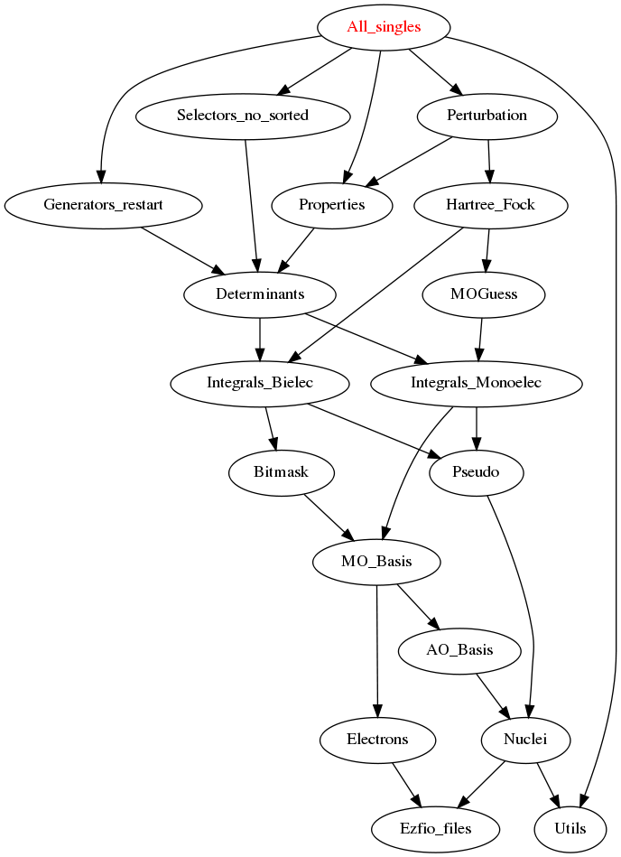

===========
All_Single Module
===========

Does all the single excitation on a given wave function

Needed Modules
==============

.. Do not edit this section. It was auto-generated from the
.. by the `update_README.py` script.

* `Perturbation <http://github.com/LCPQ/quantum_package/tree/master/src/Perturbation>`_
* `Selectors_full <http://github.com/LCPQ/quantum_package/tree/master/src/Selectors_full>`_
* `Generators_full <http://github.com/LCPQ/quantum_package/tree/master/src/Generators_full>`_
* `Psiref_CAS <http://github.com/LCPQ/quantum_package/tree/master/src/Psiref_CAS>`_
* `MRCC_Utils <http://github.com/LCPQ/quantum_package/tree/master/src/MRCC_Utils>`_

Documentation
=============

.. Do not edit this section. It was auto-generated from the
.. by the `update_README.py` script.

`mrcc <http://github.com/LCPQ/quantum_package/tree/master/src/MRCC_CASSD/mrcc_cassd.irp.f#L1>`_
  Undocumented

`print_cas_coefs <http://github.com/LCPQ/quantum_package/tree/master/src/MRCC_CASSD/mrcc_cassd.irp.f#L11>`_
  Undocumented

`routine <http://github.com/LCPQ/quantum_package/tree/master/src/MRCC_CASSD/test.irp.f#L10>`_
  Undocumented

`test <http://github.com/LCPQ/quantum_package/tree/master/src/MRCC_CASSD/test.irp.f#L1>`_
  Undocumented

Needed Modules
==============
.. Do not edit this section It was auto-generated
.. by the `update_README.py` script.

* `Generators_restart <http://github.com/LCPQ/quantum_package/tree/master/plugins/Generators_restart>`_
* `Perturbation <http://github.com/LCPQ/quantum_package/tree/master/plugins/Perturbation>`_
* `Properties <http://github.com/LCPQ/quantum_package/tree/master/plugins/Properties>`_
* `Selectors_no_sorted <http://github.com/LCPQ/quantum_package/tree/master/plugins/Selectors_no_sorted>`_
* `Utils <http://github.com/LCPQ/quantum_package/tree/master/src/Utils>`_

Documentation
=============
.. Do not edit this section It was auto-generated
.. by the `update_README.py` script.

`all_singles_h_core <http://github.com/LCPQ/quantum_package/tree/master/plugins/All_singles/all_singles_h_core.irp.f#L1>`_
  Undocumented

`h_apply_h_core_just_mono <http://github.com/LCPQ/quantum_package/tree/master/plugins/All_singles/H_apply.irp.f_shell_41#L2939>`_
  Calls H_apply on the HF determinant and selects all connected single and double
  excitations (of the same symmetry). Auto-generated by the ``generate_h_apply`` script.

`h_apply_h_core_just_mono_diexc <http://github.com/LCPQ/quantum_package/tree/master/plugins/All_singles/H_apply.irp.f_shell_41#L2372>`_
  Generate all double excitations of key_in using the bit masks of holes and
  particles.
  Assume N_int is already provided.

`h_apply_h_core_just_mono_monoexc <http://github.com/LCPQ/quantum_package/tree/master/plugins/All_singles/H_apply.irp.f_shell_41#L2722>`_
  Generate all single excitations of key_in using the bit masks of holes and
  particles.
  Assume N_int is already provided.

`h_apply_just_1h_1p <http://github.com/LCPQ/quantum_package/tree/master/plugins/All_singles/H_apply.irp.f_shell_41#L575>`_
  Calls H_apply on the HF determinant and selects all connected single and double
  excitations (of the same symmetry). Auto-generated by the ``generate_h_apply`` script.

`h_apply_just_1h_1p_diexc <http://github.com/LCPQ/quantum_package/tree/master/plugins/All_singles/H_apply.irp.f_shell_41#L1>`_
  Generate all double excitations of key_in using the bit masks of holes and
  particles.
  Assume N_int is already provided.

`h_apply_just_1h_1p_monoexc <http://github.com/LCPQ/quantum_package/tree/master/plugins/All_singles/H_apply.irp.f_shell_41#L357>`_
  Generate all single excitations of key_in using the bit masks of holes and
  particles.
  Assume N_int is already provided.

`h_apply_just_mono <http://github.com/LCPQ/quantum_package/tree/master/plugins/All_singles/H_apply.irp.f_shell_41#L1360>`_
  Calls H_apply on the HF determinant and selects all connected single and double
  excitations (of the same symmetry). Auto-generated by the ``generate_h_apply`` script.

`h_apply_just_mono_1h_1p <http://github.com/LCPQ/quantum_package/tree/master/plugins/All_singles/H_apply.irp.f_shell_41#L2154>`_
  Calls H_apply on the HF determinant and selects all connected single and double
  excitations (of the same symmetry). Auto-generated by the ``generate_h_apply`` script.

`h_apply_just_mono_1h_1p_diexc <http://github.com/LCPQ/quantum_package/tree/master/plugins/All_singles/H_apply.irp.f_shell_41#L1578>`_
  Generate all double excitations of key_in using the bit masks of holes and
  particles.
  Assume N_int is already provided.

`h_apply_just_mono_1h_1p_monoexc <http://github.com/LCPQ/quantum_package/tree/master/plugins/All_singles/H_apply.irp.f_shell_41#L1934>`_
  Generate all single excitations of key_in using the bit masks of holes and
  particles.
  Assume N_int is already provided.

`h_apply_just_mono_diexc <http://github.com/LCPQ/quantum_package/tree/master/plugins/All_singles/H_apply.irp.f_shell_41#L793>`_
  Generate all double excitations of key_in using the bit masks of holes and
  particles.
  Assume N_int is already provided.

`h_apply_just_mono_monoexc <http://github.com/LCPQ/quantum_package/tree/master/plugins/All_singles/H_apply.irp.f_shell_41#L1143>`_
  Generate all single excitations of key_in using the bit masks of holes and
  particles.
  Assume N_int is already provided.

`h_apply_just_mono_no_double_hole_pt2 <http://github.com/LCPQ/quantum_package/tree/master/plugins/All_singles/H_apply.irp.f_shell_41#L3722>`_
  Calls H_apply on the HF determinant and selects all connected single and double
  excitations (of the same symmetry). Auto-generated by the ``generate_h_apply`` script.

`h_apply_just_mono_no_double_hole_pt2_diexc <http://github.com/LCPQ/quantum_package/tree/master/plugins/All_singles/H_apply.irp.f_shell_41#L3187>`_
  Generate all double excitations of key_in using the bit masks of holes and
  particles.
  Assume N_int is already provided.

`h_apply_just_mono_no_double_hole_pt2_monoexc <http://github.com/LCPQ/quantum_package/tree/master/plugins/All_singles/H_apply.irp.f_shell_41#L3517>`_
  Generate all single excitations of key_in using the bit masks of holes and
  particles.
  Assume N_int is already provided.

`print_hp <http://github.com/LCPQ/quantum_package/tree/master/plugins/All_singles/print_hp.irp.f#L1>`_
  Undocumented

`print_stuff <http://github.com/LCPQ/quantum_package/tree/master/plugins/All_singles/print_stuff.irp.f#L1>`_
  Undocumented

`restart_more_singles <http://github.com/LCPQ/quantum_package/tree/master/plugins/All_singles/all_singles_1h_1p.irp.f#L1>`_
  Undocumented

`routine <http://github.com/LCPQ/quantum_package/tree/master/plugins/All_singles/print_stuff.irp.f#L12>`_
  Undocumented

