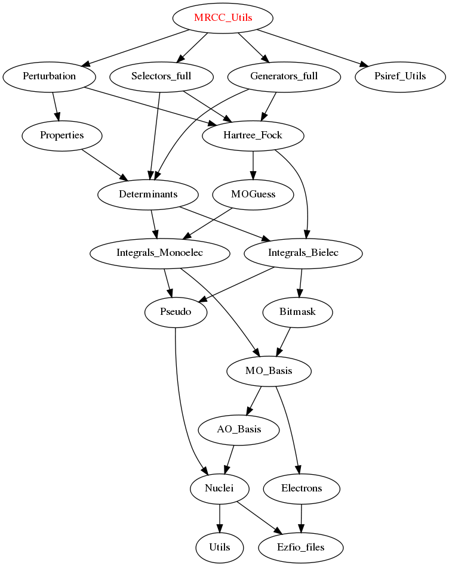

===========
CAS_effective_Hamiltonian_OVB Module
===========

Needed Modules
==============

.. Do not edit this section. It was auto-generated from the
.. by the `update_README.py` script.

* `Perturbation <http://github.com/LCPQ/quantum_package/tree/master/src/Perturbation>`_
* `Selectors_full <http://github.com/LCPQ/quantum_package/tree/master/src/Selectors_full>`_
* `Generators_full <http://github.com/LCPQ/quantum_package/tree/master/src/Generators_full>`_
* `Psiref_Utils <http://github.com/LCPQ/quantum_package/tree/master/src/Psiref_Utils>`_

Documentation
=============

.. Do not edit this section. It was auto-generated from the
.. by the `update_README.py` script.

`ci_eigenvectors_dressed <http://github.com/LCPQ/quantum_package/tree/master/src/MRCC_Utils/mrcc_utils.irp.f#L166>`_
  Eigenvectors/values of the CI matrix

`ci_eigenvectors_s2_dressed <http://github.com/LCPQ/quantum_package/tree/master/src/MRCC_Utils/mrcc_utils.irp.f#L167>`_
  Eigenvectors/values of the CI matrix

`ci_electronic_energy_dressed <http://github.com/LCPQ/quantum_package/tree/master/src/MRCC_Utils/mrcc_utils.irp.f#L165>`_
  Eigenvectors/values of the CI matrix

`ci_energy_dressed <http://github.com/LCPQ/quantum_package/tree/master/src/MRCC_Utils/mrcc_utils.irp.f#L232>`_
>>>>>>> d071a9e395b639bb8d7dfa37e6d6c1612162c780
  N_states lowest eigenvalues of the dressed CI matrix

`davidson_diag_hjj_mrcc <http://github.com/LCPQ/quantum_package/tree/master/src/MRCC_Utils/davidson.irp.f#L56>`_
  Davidson diagonalization with specific diagonal elements of the H matrix
  .br
  H_jj : specific diagonal H matrix elements to diagonalize de Davidson
  .br
  dets_in : bitmasks corresponding to determinants
  .br
  u_in : guess coefficients on the various states. Overwritten
  on exit
  .br
  dim_in : leftmost dimension of u_in
  .br
  sze : Number of determinants
  .br
  N_st : Number of eigenstates
  .br
  iunit : Unit for the I/O
  .br
  Initial guess vectors are not necessarily orthonormal

`davidson_diag_mrcc <http://github.com/LCPQ/quantum_package/tree/master/src/MRCC_Utils/davidson.irp.f#L1>`_
  Davidson diagonalization.
  .br
  dets_in : bitmasks corresponding to determinants
  .br
  u_in : guess coefficients on the various states. Overwritten
  on exit
  .br
  dim_in : leftmost dimension of u_in
  .br
  sze : Number of determinants
  .br
  N_st : Number of eigenstates
  .br
  iunit : Unit number for the I/O
  .br
  Initial guess vectors are not necessarily orthonormal

<<<<<<< HEAD
`delta_ii <http://github.com/LCPQ/quantum_package/tree/master/src/MRCC_Utils/mrcc_utils.irp.f#L45>`_
  Dressing matrix in N_det basis

`delta_ij <http://github.com/LCPQ/quantum_package/tree/master/src/MRCC_Utils/mrcc_utils.irp.f#L44>`_
  Dressing matrix in N_det basis

`diagonalize_ci_dressed <http://github.com/LCPQ/quantum_package/tree/master/src/MRCC_Utils/mrcc_utils.irp.f#L165>`_
=======
`delta_ii <http://github.com/LCPQ/quantum_package/tree/master/src/MRCC_Utils/mrcc_utils.irp.f#L104>`_
  Dressing matrix in N_det basis

`delta_ij <http://github.com/LCPQ/quantum_package/tree/master/src/MRCC_Utils/mrcc_utils.irp.f#L103>`_
  Dressing matrix in N_det basis

`diagonalize_ci_dressed <http://github.com/LCPQ/quantum_package/tree/master/src/MRCC_Utils/mrcc_utils.irp.f#L247>`_
>>>>>>> d071a9e395b639bb8d7dfa37e6d6c1612162c780
  Replace the coefficients of the CI states by the coefficients of the
  eigenstates of the CI matrix

`find_triples_and_quadruples <http://github.com/LCPQ/quantum_package/tree/master/src/MRCC_Utils/mrcc_dress.irp.f#L206>`_
  Undocumented

`h_apply_mrcc <http://github.com/LCPQ/quantum_package/tree/master/src/MRCC_Utils/H_apply.irp.f_shell_27#L422>`_
  Calls H_apply on the HF determinant and selects all connected single and double
  excitations (of the same symmetry). Auto-generated by the ``generate_h_apply`` script.

`h_apply_mrcc_diexc <http://github.com/LCPQ/quantum_package/tree/master/src/MRCC_Utils/H_apply.irp.f_shell_27#L1>`_
  Generate all double excitations of key_in using the bit masks of holes and
  particles.
  Assume N_int is already provided.

`h_apply_mrcc_monoexc <http://github.com/LCPQ/quantum_package/tree/master/src/MRCC_Utils/H_apply.irp.f_shell_27#L273>`_
  Generate all single excitations of key_in using the bit masks of holes and
  particles.
  Assume N_int is already provided.

<<<<<<< HEAD
`h_matrix_dressed <http://github.com/LCPQ/quantum_package/tree/master/src/MRCC_Utils/mrcc_utils.irp.f#L58>`_
=======
`h_matrix_dressed <http://github.com/LCPQ/quantum_package/tree/master/src/MRCC_Utils/mrcc_utils.irp.f#L140>`_
>>>>>>> d071a9e395b639bb8d7dfa37e6d6c1612162c780
  Dressed H with Delta_ij

`h_u_0_mrcc <http://github.com/LCPQ/quantum_package/tree/master/src/MRCC_Utils/davidson.irp.f#L360>`_
  Computes v_0 = H|u_0>
  .br
  n : number of determinants
  .br
  H_jj : array of <j|H|j>

`lambda_mrcc <http://github.com/LCPQ/quantum_package/tree/master/src/MRCC_Utils/mrcc_utils.irp.f#L5>`_
  cm/<Psi_0|H|D_m> or perturbative 1/Delta_E(m)

`lambda_mrcc_tmp <http://github.com/LCPQ/quantum_package/tree/master/src/MRCC_Utils/mrcc_utils.irp.f#L81>`_
  Undocumented

`lambda_pert <http://github.com/LCPQ/quantum_package/tree/master/src/MRCC_Utils/mrcc_utils.irp.f#L6>`_
  cm/<Psi_0|H|D_m> or perturbative 1/Delta_E(m)

`mrcc_dress <http://github.com/LCPQ/quantum_package/tree/master/src/MRCC_Utils/mrcc_dress.irp.f#L15>`_
  Undocumented

`mrcc_dress_simple <http://github.com/LCPQ/quantum_package/tree/master/src/MRCC_Utils/mrcc_dress.irp.f#L160>`_
  Undocumented

`mrcc_iterations <http://github.com/LCPQ/quantum_package/tree/master/src/MRCC_Utils/mrcc_general.irp.f#L7>`_
  Undocumented

<<<<<<< HEAD
=======
`oscillations <http://github.com/LCPQ/quantum_package/tree/master/src/MRCC_Utils/mrcc_utils.irp.f#L86>`_
  Undocumented

`pert_determinants <http://github.com/LCPQ/quantum_package/tree/master/src/MRCC_Utils/mrcc_utils.irp.f#L1>`_
  Undocumented

>>>>>>> d071a9e395b639bb8d7dfa37e6d6c1612162c780
`psi_ref_lock <http://github.com/LCPQ/quantum_package/tree/master/src/MRCC_Utils/mrcc_dress.irp.f#L3>`_
  Locks on ref determinants to fill delta_ij

`run_mrcc <http://github.com/LCPQ/quantum_package/tree/master/src/MRCC_Utils/mrcc_general.irp.f#L1>`_
  Undocumented

<<<<<<< HEAD
`set_generators_bitmasks_as_holes_and_particles <http://github.com/LCPQ/quantum_package/tree/master/src/MRCC_Utils/mrcc_general.irp.f#L38>`_
=======
`set_generators_bitmasks_as_holes_and_particles <http://github.com/LCPQ/quantum_package/tree/master/src/MRCC_Utils/mrcc_general.irp.f#L69>`_
>>>>>>> d071a9e395b639bb8d7dfa37e6d6c1612162c780
  Undocumented

Needed Modules
==============
.. Do not edit this section It was auto-generated
.. by the `update_README.py` script.

* `Dressed_Ref_Hamiltonian <http://github.com/LCPQ/quantum_package/tree/master/plugins/Dressed_Ref_Hamiltonian>`_
* `Psiref_CAS <http://github.com/LCPQ/quantum_package/tree/master/plugins/Psiref_CAS>`_
* `OVB <http://github.com/LCPQ/quantum_package/tree/master/plugins/OVB>`_

Documentation
=============
.. Do not edit this section It was auto-generated
.. by the `update_README.py` script.

`active_orbital_coordinates <http://github.com/LCPQ/quantum_package/tree/master/plugins/CAS_effective_Hamiltonian_OVB/orbital_distances.irp.f#L1>`_
  Undocumented

`active_orbital_distances <http://github.com/LCPQ/quantum_package/tree/master/plugins/CAS_effective_Hamiltonian_OVB/orbital_distances.irp.f#L13>`_
  Undocumented

`active_orbital_distances_sorted <http://github.com/LCPQ/quantum_package/tree/master/plugins/CAS_effective_Hamiltonian_OVB/orbital_distances.irp.f#L30>`_
  Undocumented

`active_orbital_distances_sorted_index <http://github.com/LCPQ/quantum_package/tree/master/plugins/CAS_effective_Hamiltonian_OVB/orbital_distances.irp.f#L31>`_
  Undocumented

`couples_act_orb <http://github.com/LCPQ/quantum_package/tree/master/plugins/CAS_effective_Hamiltonian_OVB/ovb_components.irp.f#L86>`_
  Undocumented

`h_matrix_between_ionic_on_given_atom <http://github.com/LCPQ/quantum_package/tree/master/plugins/CAS_effective_Hamiltonian_OVB/ovb_components.irp.f#L99>`_
  Hamiltonian matrix elements between the various contracted functions
  that have a negative charge on a given active orbital

`h_matrix_between_ionic_on_given_atom_and_others <http://github.com/LCPQ/quantum_package/tree/master/plugins/CAS_effective_Hamiltonian_OVB/ovb_components.irp.f#L155>`_
  Hamiltonian matrix elements between the various contracted functions
  that have a negative charge on a given active orbital
  and all the other fully contracted OVB structures

`h_matrix_psi_det_ovb <http://github.com/LCPQ/quantum_package/tree/master/plugins/CAS_effective_Hamiltonian_OVB/ovb_components.irp.f#L288>`_
  H matrix between the fully contracted OVB forms

`h_ovb_dressing <http://github.com/LCPQ/quantum_package/tree/master/plugins/CAS_effective_Hamiltonian_OVB/OVB_effective_H.irp.f#L1>`_
  Hamiltonian matrix expressed in the basis of all the

`h_ovb_naked <http://github.com/LCPQ/quantum_package/tree/master/plugins/CAS_effective_Hamiltonian_OVB/ovb_components.irp.f#L57>`_
  Hamiltonian matrix expressed in the basis of contracted forms in terms of ionic structures

`h_ovb_naked_first_ionic <http://github.com/LCPQ/quantum_package/tree/master/plugins/CAS_effective_Hamiltonian_OVB/ovb_components.irp.f#L420>`_
  H_OVB_naked_first_ionic(1,i) = H_matrix element between the first ionic determinants belonging to is_a_first_ionic_couple = True
  and the contracted ith ionic form
  if i == 1 not defined
  H_OVB_naked_first_ionic(2,i) = H_matrix element between the first ionic determinants belonging to is_a_first_ionic_couple = False
  and the contracted ith ionic form
  if i == 1 not defined
  H_OVB_naked_first_ionic_between_ionic(1,1) = H_matrix element between the first ionic determinants belonging to is_a_first_ionic_couple = True
  and the first ionic determinants belonging to is_a_first_ionic_couple = True
  H_OVB_naked_first_ionic_between_ionic(1,2) = H_matrix element between the first ionic determinants belonging to is_a_first_ionic_couple = True
  and the first ionic determinants belonging to is_a_first_ionic_couple = False
  H_OVB_naked_first_ionic_between_ionic(2,2) = H_matrix element between the first ionic determinants belonging to is_a_first_ionic_couple = False
  and the first ionic determinants belonging to is_a_first_ionic_couple = False

`h_ovb_naked_first_ionic_between_ionic <http://github.com/LCPQ/quantum_package/tree/master/plugins/CAS_effective_Hamiltonian_OVB/ovb_components.irp.f#L421>`_
  H_OVB_naked_first_ionic(1,i) = H_matrix element between the first ionic determinants belonging to is_a_first_ionic_couple = True
  and the contracted ith ionic form
  if i == 1 not defined
  H_OVB_naked_first_ionic(2,i) = H_matrix element between the first ionic determinants belonging to is_a_first_ionic_couple = False
  and the contracted ith ionic form
  if i == 1 not defined
  H_OVB_naked_first_ionic_between_ionic(1,1) = H_matrix element between the first ionic determinants belonging to is_a_first_ionic_couple = True
  and the first ionic determinants belonging to is_a_first_ionic_couple = True
  H_OVB_naked_first_ionic_between_ionic(1,2) = H_matrix element between the first ionic determinants belonging to is_a_first_ionic_couple = True
  and the first ionic determinants belonging to is_a_first_ionic_couple = False
  H_OVB_naked_first_ionic_between_ionic(2,2) = H_matrix element between the first ionic determinants belonging to is_a_first_ionic_couple = False
  and the first ionic determinants belonging to is_a_first_ionic_couple = False

`h_ovb_total_dressed <http://github.com/LCPQ/quantum_package/tree/master/plugins/CAS_effective_Hamiltonian_OVB/OVB_effective_H.irp.f#L29>`_
  Hamiltonian matrix expressed in the basis of all the

`ionic_index <http://github.com/LCPQ/quantum_package/tree/master/plugins/CAS_effective_Hamiltonian_OVB/ovb_components.irp.f#L27>`_
  Index of the various determinants in psi_ref according to their level of ionicity
  ionic_index(i,0) = number of determinants in psi_ref having the degree of ionicity "i"
  ionic_index(i,j) = index of the determinants having the degree of ionicity "i"

`is_a_first_ionic_couple <http://github.com/LCPQ/quantum_package/tree/master/plugins/CAS_effective_Hamiltonian_OVB/ovb_components.irp.f#L323>`_
  Number of determinants belonging to the class of first ionic
  AND that have a couple of positive/negative charge belonging
  to a couple of orbital couples_act_orb
  If is_a_first_ionic_couple(i) = .True. then this determinant is a first ionic
  and have a couple of positive/negative charge belonging
  to a couple of orbital couples_act_orb
  normalization factor (1) = 1/(sum c_i^2   .with. is_a_first_ionic_couple(i) = .True.)
  normalization factor (2) = 1/(sum c_i^2   .with. is_a_first_ionic_couple(i) = .False.)

`is_a_neutral_no_hund_couple <http://github.com/LCPQ/quantum_package/tree/master/plugins/CAS_effective_Hamiltonian_OVB/ovb_components.irp.f#L366>`_
  Number of determinants belonging to the class of neutral determinants
  AND that have a couple of alpha beta electrons in couple of orbital couples_act_orb
  If is_a_neutral_no_hund_couple(i) = .True. then this determinant is a neutral determinants
  and have a a couple of alpha beta electrons in couple of orbital couples_act_orb
  normalization factor (1) = 1/sqrt(sum c_i^2   .with. is_a_neutral_no_hund_couple(i) = .True.)
  normalization factor (2) = 1/sqrt(sum c_i^2   .with. is_a_neutral_no_hund_couple(i) = .False.)

`max_number_ionic <http://github.com/LCPQ/quantum_package/tree/master/plugins/CAS_effective_Hamiltonian_OVB/ovb_components.irp.f#L3>`_
  Maximum and minimum number of ionization in psi_ref

`min_number_ionic <http://github.com/LCPQ/quantum_package/tree/master/plugins/CAS_effective_Hamiltonian_OVB/ovb_components.irp.f#L4>`_
  Maximum and minimum number of ionization in psi_ref

`n_couples_act_orb <http://github.com/LCPQ/quantum_package/tree/master/plugins/CAS_effective_Hamiltonian_OVB/ovb_components.irp.f#L81>`_
  Undocumented

`n_det_ionic_on_given_atom <http://github.com/LCPQ/quantum_package/tree/master/plugins/CAS_effective_Hamiltonian_OVB/ovb_components.irp.f#L203>`_
  number of determinants that are mono ionic with the negative charge
  on a given atom, normalization_factor, array of determinants,and coefficients

`normalization_factor_ionic <http://github.com/LCPQ/quantum_package/tree/master/plugins/CAS_effective_Hamiltonian_OVB/ovb_components.irp.f#L28>`_
  Index of the various determinants in psi_ref according to their level of ionicity
  ionic_index(i,0) = number of determinants in psi_ref having the degree of ionicity "i"
  ionic_index(i,j) = index of the determinants having the degree of ionicity "i"

`normalization_factor_ionic_dressed <http://github.com/LCPQ/quantum_package/tree/master/plugins/CAS_effective_Hamiltonian_OVB/OVB_effective_H.irp.f#L45>`_
  Undocumented

`normalization_factor_ionic_on_given_atom <http://github.com/LCPQ/quantum_package/tree/master/plugins/CAS_effective_Hamiltonian_OVB/ovb_components.irp.f#L204>`_
  number of determinants that are mono ionic with the negative charge
  on a given atom, normalization_factor, array of determinants,and coefficients

`normalization_factor_neutra_no_hund_couple <http://github.com/LCPQ/quantum_package/tree/master/plugins/CAS_effective_Hamiltonian_OVB/ovb_components.irp.f#L367>`_
  Number of determinants belonging to the class of neutral determinants
  AND that have a couple of alpha beta electrons in couple of orbital couples_act_orb
  If is_a_neutral_no_hund_couple(i) = .True. then this determinant is a neutral determinants
  and have a a couple of alpha beta electrons in couple of orbital couples_act_orb
  normalization factor (1) = 1/sqrt(sum c_i^2   .with. is_a_neutral_no_hund_couple(i) = .True.)
  normalization factor (2) = 1/sqrt(sum c_i^2   .with. is_a_neutral_no_hund_couple(i) = .False.)

`normalization_factor_special_first_ionic <http://github.com/LCPQ/quantum_package/tree/master/plugins/CAS_effective_Hamiltonian_OVB/ovb_components.irp.f#L324>`_
  Number of determinants belonging to the class of first ionic
  AND that have a couple of positive/negative charge belonging
  to a couple of orbital couples_act_orb
  If is_a_first_ionic_couple(i) = .True. then this determinant is a first ionic
  and have a couple of positive/negative charge belonging
  to a couple of orbital couples_act_orb
  normalization factor (1) = 1/(sum c_i^2   .with. is_a_first_ionic_couple(i) = .True.)
  normalization factor (2) = 1/(sum c_i^2   .with. is_a_first_ionic_couple(i) = .False.)

`number_first_ionic_couples <http://github.com/LCPQ/quantum_package/tree/master/plugins/CAS_effective_Hamiltonian_OVB/ovb_components.irp.f#L322>`_
  Number of determinants belonging to the class of first ionic
  AND that have a couple of positive/negative charge belonging
  to a couple of orbital couples_act_orb
  If is_a_first_ionic_couple(i) = .True. then this determinant is a first ionic
  and have a couple of positive/negative charge belonging
  to a couple of orbital couples_act_orb
  normalization factor (1) = 1/(sum c_i^2   .with. is_a_first_ionic_couple(i) = .True.)
  normalization factor (2) = 1/(sum c_i^2   .with. is_a_first_ionic_couple(i) = .False.)

`number_neutral_no_hund_couples <http://github.com/LCPQ/quantum_package/tree/master/plugins/CAS_effective_Hamiltonian_OVB/ovb_components.irp.f#L365>`_
  Number of determinants belonging to the class of neutral determinants
  AND that have a couple of alpha beta electrons in couple of orbital couples_act_orb
  If is_a_neutral_no_hund_couple(i) = .True. then this determinant is a neutral determinants
  and have a a couple of alpha beta electrons in couple of orbital couples_act_orb
  normalization factor (1) = 1/sqrt(sum c_i^2   .with. is_a_neutral_no_hund_couple(i) = .True.)
  normalization factor (2) = 1/sqrt(sum c_i^2   .with. is_a_neutral_no_hund_couple(i) = .False.)

`pouet <http://github.com/LCPQ/quantum_package/tree/master/plugins/CAS_effective_Hamiltonian_OVB/filters_ionic.irp.f#L1>`_
  Undocumented

`print <http://github.com/LCPQ/quantum_package/tree/master/plugins/CAS_effective_Hamiltonian_OVB/print_OVB_effective_H_diagonalized.irp.f#L1>`_
  Undocumented

`print_ovb <http://github.com/LCPQ/quantum_package/tree/master/plugins/CAS_effective_Hamiltonian_OVB/print_det_ionic.irp.f#L1>`_
  Undocumented

`provide_all <http://github.com/LCPQ/quantum_package/tree/master/plugins/CAS_effective_Hamiltonian_OVB/print_det_ionic.irp.f#L8>`_
  Undocumented

`provide_all_stuffs <http://github.com/LCPQ/quantum_package/tree/master/plugins/CAS_effective_Hamiltonian_OVB/print_OVB_effective_H_diagonalized.irp.f#L6>`_
  Undocumented

`psi_coef_mono_ionic_on_given_atom <http://github.com/LCPQ/quantum_package/tree/master/plugins/CAS_effective_Hamiltonian_OVB/ovb_components.irp.f#L205>`_
  number of determinants that are mono ionic with the negative charge
  on a given atom, normalization_factor, array of determinants,and coefficients

`psi_coef_ovb <http://github.com/LCPQ/quantum_package/tree/master/plugins/CAS_effective_Hamiltonian_OVB/ovb_components.irp.f#L255>`_
  Array of the determinants belonging to each ovb structures (neutral, mono ionic, bi ionic etc ...)
  together with the arrays of coefficients

`psi_det_mono_ionic_on_given_atom <http://github.com/LCPQ/quantum_package/tree/master/plugins/CAS_effective_Hamiltonian_OVB/ovb_components.irp.f#L206>`_
  number of determinants that are mono ionic with the negative charge
  on a given atom, normalization_factor, array of determinants,and coefficients

`psi_det_ovb <http://github.com/LCPQ/quantum_package/tree/master/plugins/CAS_effective_Hamiltonian_OVB/ovb_components.irp.f#L254>`_
  Array of the determinants belonging to each ovb structures (neutral, mono ionic, bi ionic etc ...)
  together with the arrays of coefficients

`ratio_hund_no_hund <http://github.com/LCPQ/quantum_package/tree/master/plugins/CAS_effective_Hamiltonian_OVB/ovb_components.irp.f#L368>`_
  Number of determinants belonging to the class of neutral determinants
  AND that have a couple of alpha beta electrons in couple of orbital couples_act_orb
  If is_a_neutral_no_hund_couple(i) = .True. then this determinant is a neutral determinants
  and have a a couple of alpha beta electrons in couple of orbital couples_act_orb
  normalization factor (1) = 1/sqrt(sum c_i^2   .with. is_a_neutral_no_hund_couple(i) = .True.)
  normalization factor (2) = 1/sqrt(sum c_i^2   .with. is_a_neutral_no_hund_couple(i) = .False.)

`routine <http://github.com/LCPQ/quantum_package/tree/master/plugins/CAS_effective_Hamiltonian_OVB/save_wf_only_neutral_and_1p_amplitudes.irp.f#L8>`_
  Undocumented

`save_wf <http://github.com/LCPQ/quantum_package/tree/master/plugins/CAS_effective_Hamiltonian_OVB/save_wf_only_neutral_and_1p_amplitudes.irp.f#L1>`_
  Undocumented

