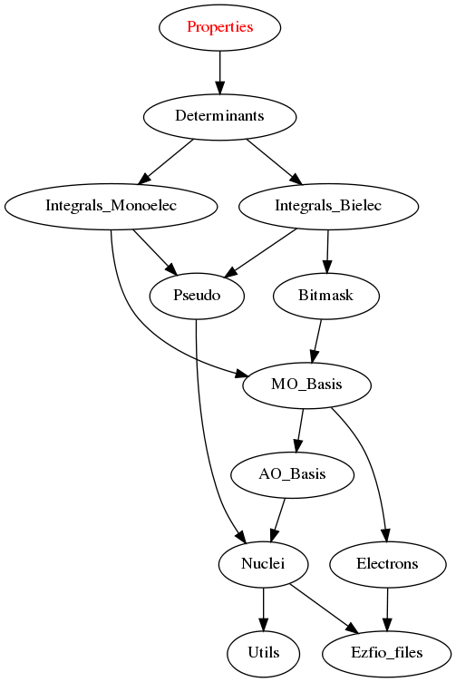

=================
Properties Module
=================

Needed Modules
==============

.. Do not edit this section It was auto-generated
.. by the `update_README.py` script.

* `Determinants <http://github.com/LCPQ/quantum_package/tree/master/src/Determinants>`_

Needed Modules
==============
.. Do not edit this section It was auto-generated
.. by the `update_README.py` script.

* `Determinants <http://github.com/LCPQ/quantum_package/tree/master/src/Determinants>`_

Documentation
=============
.. Do not edit this section It was auto-generated
.. by the `update_README.py` script.

`ao_integrated_delta_rho_all_points <http://github.com/LCPQ/quantum_package/tree/master/plugins/Properties/delta_rho.irp.f#L61>`_
  array of the overlap in x,y between the AO function and integrated between [z,z+dz] in the z axis
  for all the z points that are given (N_z_pts)

`ao_integrated_delta_rho_all_points_z <http://github.com/LCPQ/quantum_package/tree/master/plugins/Properties/delta_rho.irp.f#L268>`_
  array of the overlap in x,y between the AO function and integrated between [z,z+dz] in the z axis
  for all the z points that are given (N_z_pts)

`ao_integrated_delta_rho_one_point <http://github.com/LCPQ/quantum_package/tree/master/plugins/Properties/delta_rho.irp.f#L130>`_
  array of the overlap in x,y between the AO function and integrated between [z,z+dz] in the z axis
  for one specific z point

`average_position <http://github.com/LCPQ/quantum_package/tree/master/plugins/Properties/properties.irp.f#L1>`_
  average_position(1) = <psi_det|X|psi_det>
  average_position(2) = <psi_det|Y|psi_det>
  average_position(3) = <psi_det|Z|psi_det>

`average_spread <http://github.com/LCPQ/quantum_package/tree/master/plugins/Properties/properties.irp.f#L27>`_
  average_spread(1) = <psi_det|X^2|psi_det>
  average_spread(2) = <psi_det|Y^2|psi_det>
  average_spread(3) = <psi_det|Z^2|psi_det>

`delta_z <http://github.com/LCPQ/quantum_package/tree/master/plugins/Properties/delta_rho.irp.f#L4>`_
  Undocumented

`diag_o1_mat_elem <http://github.com/LCPQ/quantum_package/tree/master/plugins/Properties/slater_rules_mono_electronic.irp.f#L91>`_
  Computes <i|O1|i>

`diag_o1_mat_elem_alpha_beta <http://github.com/LCPQ/quantum_package/tree/master/plugins/Properties/slater_rules_mono_electronic.irp.f#L210>`_
  Computes <i|O1(alpha) -O1(beta)|i>

`electronic_population_alpha <http://github.com/LCPQ/quantum_package/tree/master/plugins/Properties/mulliken.irp.f#L46>`_
  spin population on the ao basis :
  spin_population(i,j) = rho_AO(alpha)(i,j) - rho_AO(beta)(i,j) * <AO_i|AO_j>

`electronic_population_beta <http://github.com/LCPQ/quantum_package/tree/master/plugins/Properties/mulliken.irp.f#L47>`_
  spin population on the ao basis :
  spin_population(i,j) = rho_AO(alpha)(i,j) - rho_AO(beta)(i,j) * <AO_i|AO_j>

`filter_connected_mono <http://github.com/LCPQ/quantum_package/tree/master/plugins/Properties/slater_rules_mono_electronic.irp.f#L240>`_
  Filters out the determinants that are not connected through PURE
  .br
  MONO EXCITATIONS OPERATORS (a^{\dagger}j a_i)
  .br
  returns the array idx which contains the index of the
  .br
  determinants in the array key1 that interact
  .br
  via some PURE MONO EXCITATIONS OPERATORS
  .br
  idx(0) is the number of determinants that interact with key1

`get_average <http://github.com/LCPQ/quantum_package/tree/master/plugins/Properties/average.irp.f#L1>`_
  computes the average value of a pure MONO ELECTRONIC OPERATOR
  whom integrals on the MO basis are stored in "array"
  and with the density is stored in  "density"

`gross_orbital_product_alpha <http://github.com/LCPQ/quantum_package/tree/master/plugins/Properties/mulliken.irp.f#L65>`_
  gross orbital product

`gross_orbital_product_beta <http://github.com/LCPQ/quantum_package/tree/master/plugins/Properties/mulliken.irp.f#L66>`_
  gross orbital product

`i_o1_j <http://github.com/LCPQ/quantum_package/tree/master/plugins/Properties/slater_rules_mono_electronic.irp.f#L1>`_
  Returns <i|O1|j> where i and j are determinants
  and O1 is a ONE BODY OPERATOR
  array  is the array of the mono electronic operator
  on the MO basis

`i_o1_j_alpha_beta <http://github.com/LCPQ/quantum_package/tree/master/plugins/Properties/slater_rules_mono_electronic.irp.f#L158>`_
  Returns <i|O1(alpha) - O1(beta)|j> where i and j are determinants
  and O1 is a ONE BODY OPERATOR
  array  is the array of the mono electronic operator
  on the MO basis

`i_o1_psi <http://github.com/LCPQ/quantum_package/tree/master/plugins/Properties/slater_rules_mono_electronic.irp.f#L52>`_
  <key|O1|psi> for the various Nstates
  and O1 is a ONE BODY OPERATOR
  array  is the array of the mono electronic operator
  on the MO basis

`i_o1_psi_alpha_beta <http://github.com/LCPQ/quantum_package/tree/master/plugins/Properties/slater_rules_mono_electronic.irp.f#L119>`_
  <key|O1(alpha) - O1(beta)|psi> for the various Nstates
  and O1 is a ONE BODY OPERATOR
  array  is the array of the mono electronic operator
  on the MO basis

`i_unit_integrated_delta_rho <http://github.com/LCPQ/quantum_package/tree/master/plugins/Properties/delta_rho.irp.f#L118>`_
  fortran unit for the writing of the integrated delta_rho

`integrated_delta_rho_all_points <http://github.com/LCPQ/quantum_package/tree/master/plugins/Properties/delta_rho.irp.f#L15>`_
  .br
  integrated_rho(alpha,z) - integrated_rho(beta,z) for all the z points
  chosen
  .br

`integrated_delta_rho_all_points_z <http://github.com/LCPQ/quantum_package/tree/master/plugins/Properties/delta_rho.irp.f#L224>`_
  .br
  integrated_rho(alpha,z) - integrated_rho(beta,z) for all the z points
  chosen
  .br

`integrated_delta_rho_one_point <http://github.com/LCPQ/quantum_package/tree/master/plugins/Properties/delta_rho.irp.f#L212>`_
  .br
  integral (x,y) and (z,z+delta_z) of rho(alpha) - rho(beta)
  on the MO basis
  .br

`mo_integrated_delta_rho_one_point <http://github.com/LCPQ/quantum_package/tree/master/plugins/Properties/delta_rho.irp.f#L184>`_
  .br
  array of the integrals needed of integrated_rho(alpha,z) - integrated_rho(beta,z) for z = z_one_point
  on the MO basis
  .br

`mulliken_densities_alpha <http://github.com/LCPQ/quantum_package/tree/master/plugins/Properties/mulliken.irp.f#L82>`_
  .br

`mulliken_densities_beta <http://github.com/LCPQ/quantum_package/tree/master/plugins/Properties/mulliken.irp.f#L83>`_
  .br

`mulliken_spin_densities <http://github.com/LCPQ/quantum_package/tree/master/plugins/Properties/mulliken.irp.f#L33>`_
  ATOMIC SPIN POPULATION (ALPHA MINUS BETA)

`n_z_pts <http://github.com/LCPQ/quantum_package/tree/master/plugins/Properties/delta_rho.irp.f#L1>`_
  Undocumented

`pout <http://github.com/LCPQ/quantum_package/tree/master/plugins/Properties/print_positive.irp.f#L1>`_
  Undocumented

`print_mulliken <http://github.com/LCPQ/quantum_package/tree/master/plugins/Properties/print_mulliken_list.irp.f#L1>`_
  Undocumented

`sabpartial_direction <http://github.com/LCPQ/quantum_package/tree/master/plugins/Properties/need.irp.f#L2>`_
  Undocumented

`spin_gross_orbital_product <http://github.com/LCPQ/quantum_package/tree/master/plugins/Properties/mulliken.irp.f#L18>`_
  gross orbital product for the spin population

`spin_population <http://github.com/LCPQ/quantum_package/tree/master/plugins/Properties/mulliken.irp.f#L2>`_
  spin population on the ao basis :
  spin_population(i,j) = rho_AO(alpha)(i,j) - rho_AO(beta)(i,j) * <AO_i|AO_j>

`test <http://github.com/LCPQ/quantum_package/tree/master/plugins/Properties/print_mulliken_list.irp.f#L9>`_
  Undocumented

`test_average_value <http://github.com/LCPQ/quantum_package/tree/master/plugins/Properties/routines_test.irp.f#L3>`_
  Undocumented

`test_average_value_alpha_beta <http://github.com/LCPQ/quantum_package/tree/master/plugins/Properties/routines_test.irp.f#L25>`_
  Undocumented

`test_dm <http://github.com/LCPQ/quantum_package/tree/master/plugins/Properties/routines_test.irp.f#L56>`_
  Undocumented

`z_max <http://github.com/LCPQ/quantum_package/tree/master/plugins/Properties/delta_rho.irp.f#L3>`_
  Undocumented

`z_min <http://github.com/LCPQ/quantum_package/tree/master/plugins/Properties/delta_rho.irp.f#L2>`_
  Undocumented

`z_one_point <http://github.com/LCPQ/quantum_package/tree/master/plugins/Properties/ezfio_interface.irp.f#L6>`_
  z point on which the integrated delta rho is calculated

